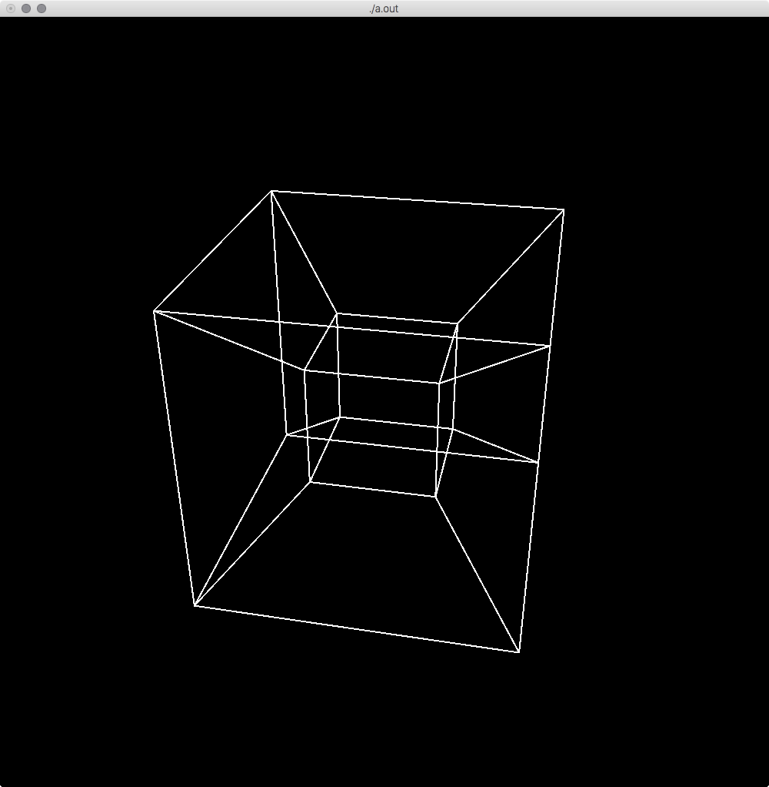

Animating Tesseract
===================

OpenGL program of a [tesseract](http://en.wikipedia.org/wiki/Tesseract) performing rotation.




Run
---

```sh
$ make && ./a.out
```


Usage
-----

| Key     | Description              |
| ------- | ------------------------ |
| `t`     | Start or stop animation  |
| `n`     | Goto next frame          |
| `p`     | Goto previous frame      |
| `<Esc>` | Quit program             |
